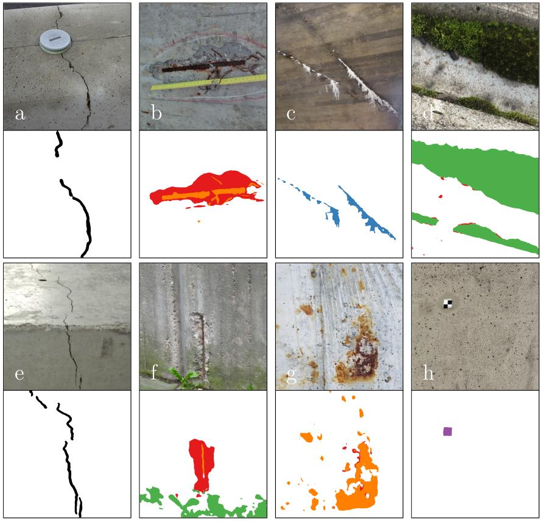
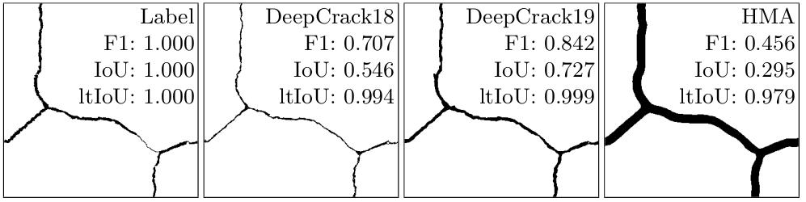
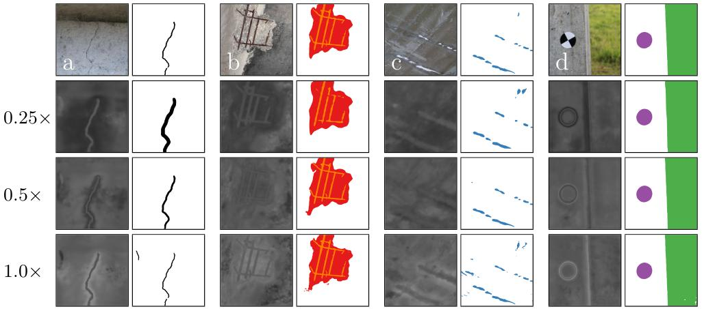
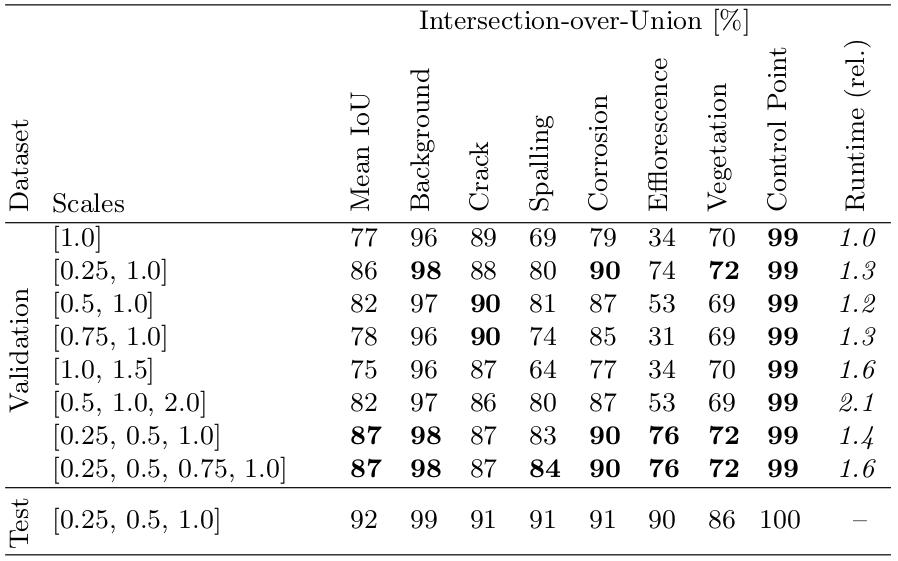
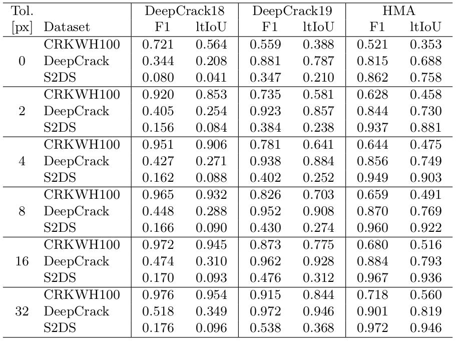

# Structural Defect Detection 
## Detection of Cracks and other Structural Defects in Concrete Surfaces

This repository hosts the code for the publication:

**Image-based Detection of Structural Defects using Hierarchical Multi-Scale Attention**

Benz, C., & Rodehorst, V. (2022). Image-based Detection of Structural Defects using Hierarchical Multi-Scale Attention. In *DAGM German Conference on Pattern Recognition*. Springer, Cham.

Always cite the work properly:
```
@inproceedings{benz2022defects,
  title={Image-based Detection of Structural Defects using Hierarchical Multi-Scale Attention},
  author={Benz, Christian and Rodehorst, Volker},
  booktitle={DAGM German Conference on Pattern Recognition},
  year={2022},
  organization={Springer}
}
```
### Credit
Code and conceptual work is based on the Hierarchical Multi-Scale Attention approach by Tao et al. (2020): 
- https://github.com/NVIDIA/semantic-segmentation
- https://arxiv.org/abs/2005.10821


### Qualitative Results


## Dataset
The <u>S</u>tructural <u>D</u>efects <u>D</u>ata<u>s</u>et (S2DS) war created and used for the purpose of this work. For further information, please refer to https://github.com/ben-z-original/s2ds.

In case you want to run the inference, download the dataset, unzip it, and place the s2ds properly in the folder ``imgs``. Thus, the path ``imgs/s2ds/test`` must be present.

## Setup and Run
Tested on Ubuntu 20.4 LTS with Python 3.8 and PyTorch 1.8.2 running CUDA 11.1 for a GeForce RTX 2080 Ti GPU. Also refer to the requirements.txt for version details.

#### 1. Clone and Environment
```
git clone https://github.com/ben-z-original/detectionhma
conda create --name detectionhma_env python=3.8
```

#### 2. Satisfy Dependencies
Satisfy the dependencies either via ``pip install -r requirements.txt`` or manully for example by:
```
pip install opencv-python
pip install torch==1.8.2 torchvision==0.9.2 --extra-index-url https://download.pytorch.org/whl/lts/1.8/cu111
pip install matplotlib
pip install tqdm
pip install runx
pip install scipy
```

#### 3. Satisfy Apex Dependency
The apex dependency requires a different treatment. Please refer to https://github.com/NVIDIA/apex. The following could help:
```
git clone https://github.com/NVIDIA/apex
cd apex
pip install -v --disable-pip-version-check --no-cache-dir --global-option="--cpp_ext" --global-option="--cuda_ext" ./
```

#### 4. Download Weights
The trained weights need to be downloaded from https://drive.google.com/file/d/19RANYtB6ooQ6mBn-CiUCWEig124F1yrj/view?usp=sharing. Unzip them and place the two weight files in a ``seg_weights`` folder. 

#### 5. Verify Dataset
Check that you placed the S2DS dataset properly according to the above instructions.

#### 6. Run
If dataset, weights, and dependencies are correctly prepared, you can run ``python inference.py``. The predictions will occur in the ``imgs/s2ds/test`` folder alongside the input images and the labels. The predictions are  indicated by infix ``_pred``, the attention maps by infix ``_attn`` . Please refer to the ``inference.py`` for more details. A simple inference typically looks like:
```
        img = cv2.imread(path, cv2.IMREAD_COLOR)
        img = cv2.cvtColor(img, cv2.COLOR_BGR2RGB)

        img = InferenceHMA.normalize(img)
        pred, _ = infer.run_large(img)

        plt.imshow(pred['pred'])
        plt.show()
```


## Metric
### Line-based Tolerant Intersection-over-Union (ltIoU)


## More Results
### Attention


### Scales


### Benchmarking



